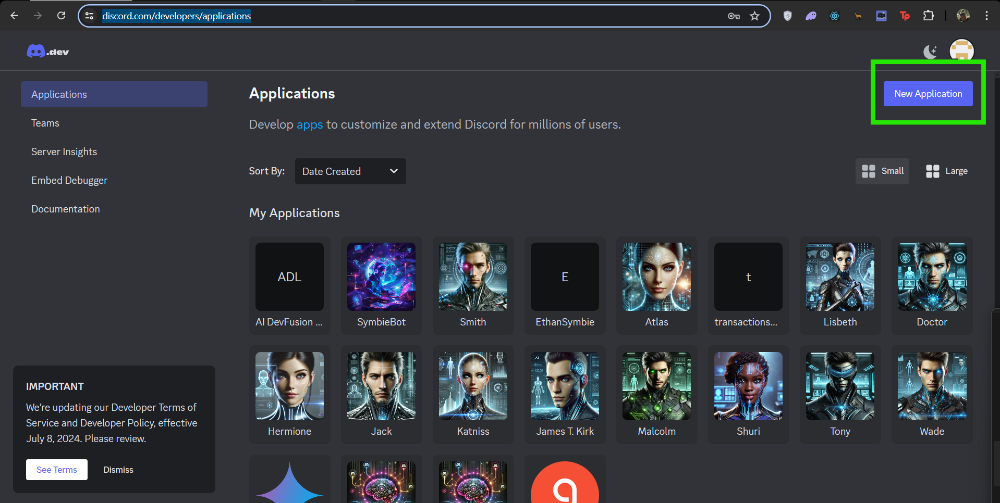
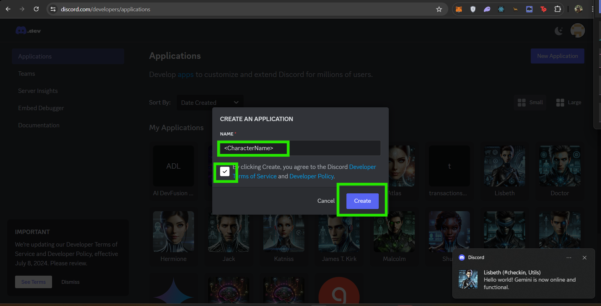
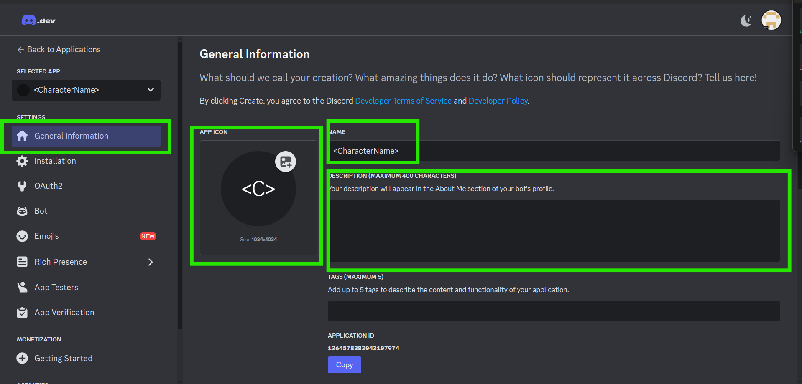
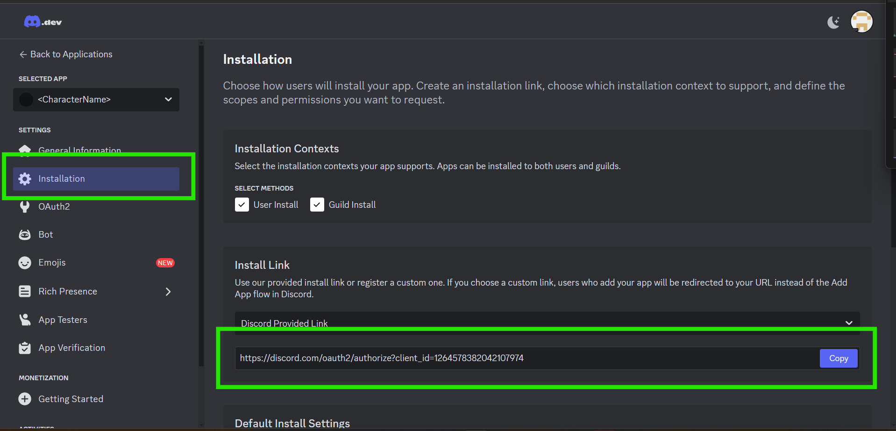
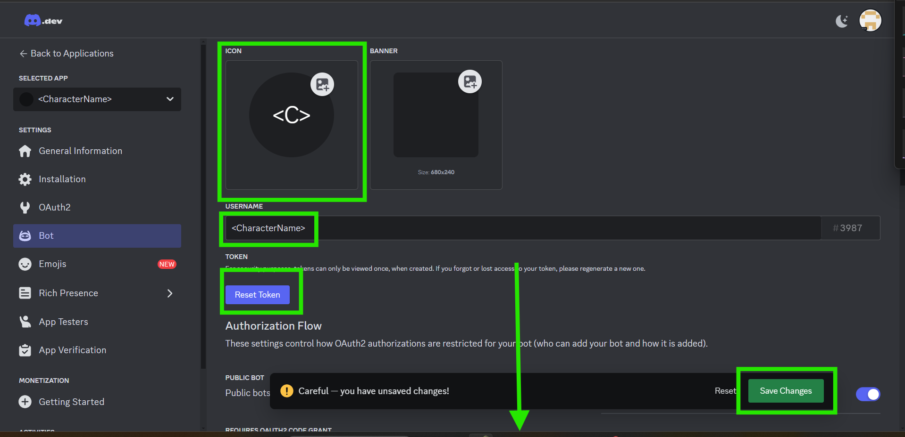
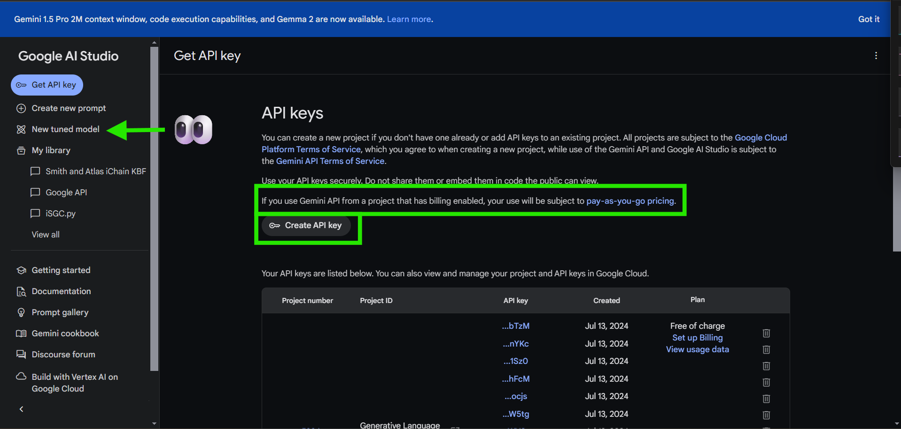
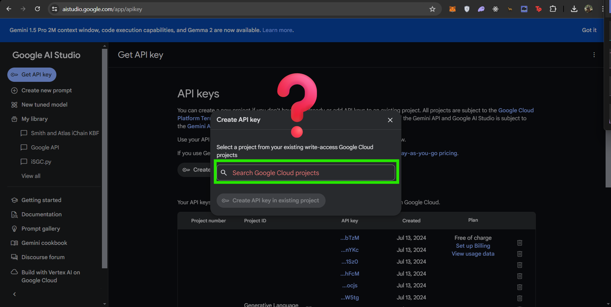

# Welcome to iMOB, iChain's Mixture of iBots


**First watch these videos**

[Watch the video](https://youtu.be/FoUWHfh733Y?si=5yYmkEuTRv-a3VrH)

```python
def video_recommendation(video1_resonates, video2_resonates):
    if video1_resonates:
        print("Great! We recommend you watch Video2.")

        if video2_resonates:
            print("Excellent! Both videos resonated with you. Let's proceed with the next steps.")
        else:
            print("We hope Video2 will provide additional insights.")
    else:
        print("We appreciate your feedback. We hope to adapt our content to better meet your needs soon.")
```

[Watch the video](https://youtu.be/UprcpdwuwCg?si=Ug78KkixyKo1xzVA)

So, you get were we're coming form??? Cool please procees 'heathan' :smirk:

## **Note**

This code **only** works with Google Gemini! Dispite a great deal of effort the **only** way this has worked effectivly is with Google Gemini. You can 'try' other providers but given the difference in API's and using python in Discord it is 'Certain' to fail. But who cares Gemini1.5 is a 2m context window and free for 'personal' use... so personalize the hell out of this bot ;)... and add Claude cause well he's trouble but cool.

**Important Note!** Both 'assistant' and 'agent' are leagal terms iChain ignores on the princple of 'no studpid shit', part of us not giving a solitar subtle fuck about the ways of old. As such to duck liabuilty a modern way we will only built and iBots which I am sure is yet to be define and thus lacking in legal understanding and thus liabuility. **Fuck if I know, :bot: did it :person_shrug:**

We are here to inspire 'Passionaitly crowdsourced technologies [that] will be able to out evolve our systems of inslavement'

We will obviously adopt many ways of old into our Guild, however for liabuility sake... just builb 'iBots'. And leave the 'agents' and 'assistants' to the bottlenecks of the past please.

## To be the change, please;

**Clone the repo**

```
git clone https://github.com/Dcamy/iMOB.git
```

**Run**

```
pip install -r requirements.txt
```

**Update** the 'XCharacterName.md' <---- _change that file name while you're at it_

(Gemini is great but Claude 3.5 is the dopest writer),

**Search** '<CharacterName>' in 'XCharacterName.py' <---- _change that file name while you're at it_ and set all three instances to the 'first' name of your bot's character

Get a Discord Bot token **note the 10k SGC reward _per platform_** you can expand us to. To claim dev rewards submit your pull request on the iChain server with Xshared '<Link to PR>'

**Go to** [Discord Dev](https://discord.com/developers/applications) and click **New Application**



**Become a God**... oh sorry I mean the PC word 'Creator' as if their was a difference. Anyways add a name here (hint the AI has to have a clue so the more it was 'maybe' trained on that character the better... like bring 'all' the spidermans... fuck! It and 'spidermen' and yet its still plearal damned paradoxes!)

Anyways click 'I am a God'/Create



**Then** Add some shit, PFP, <CharacterName>, Discription (super power)



**You need the link, but keep scrolling there is more here**



**Add** 'Bot' and 'Administrator' and save that shit before clicking away



**Hit** all 3 switches (and save)


**Share the Invite link** in the [iChain Guild](https://discord.gg/9FRj6EcmFS) and tag @Dcamy.
**Note** Guild is an old AF legal word but we like this one... and clan 😉

## Moving on to Gemini

**Go to** [Get your free API](https://aistudio.google.com/app/apikey) from Google

## Please read the API billing

and someone please set up the rate limit in the code so we never hit it, I think we are slow enough with everything else its no worries but...





### Remember

**_10,000 SGC, for each new tool or skill_** added to the repo, primary requirement is no Paid APIs required to run it. We are already subject Discord and Gemini, lets hope that holds out till we have our own models
