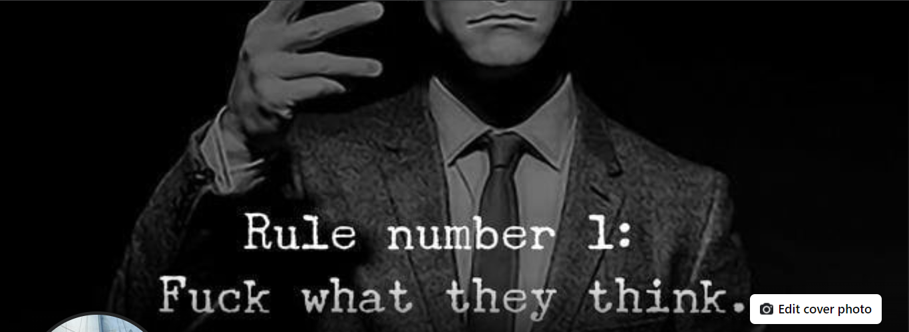
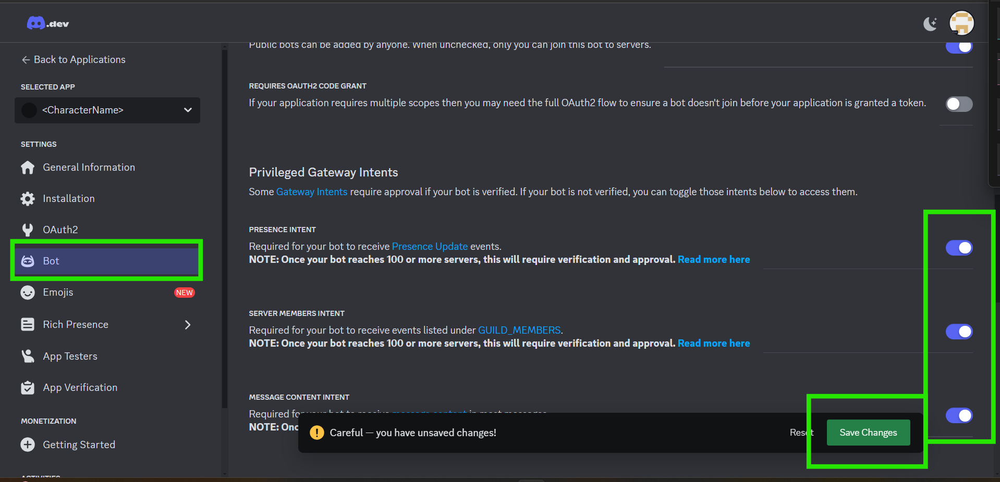

# Welcome to iMOB, iChain's Mixture of iBots 🤖🌐

Demo Comment for commit example



**First, check out these amazing videos!** 🎥

[Watch Video 1](https://youtu.be/FoUWHfh733Y?si=5yYmkEuTRv-a3VrH)

```python
def video_recommendation(video1_resonates, video2_resonates):
    if video1_resonates:
        print("Great! We recommend you watch Video 2.")

        if video2_resonates:
            print("Excellent! Both videos resonated with you. Let's proceed with the next steps.")
        else:
            print("We hope Video 2 will provide additional insights.")
    else:
        print("We appreciate your feedback. We hope to adapt our content to better meet your needs soon.")
```

[Watch Video 2](https://youtu.be/UprcpdwuwCg?si=Ug78KkixyKo1xzVA)

So, you get where we're coming from? Cool! Please proceed, brave explorer! 😎

[Still trying to put it together? Watch the bonus video](https://youtu.be/VLbWnJGlyMU?si=-CL2BTCTqxatnQRP)

## **Note** 📝

This code **only** works with Google Gemini! Despite our best efforts, the **only** way this has worked effectively is with Google Gemini. You can try other providers, but given the differences in APIs and using Python in Discord, it's likely to fail. But hey, Gemini 1.5 has a 2M context window and is free for 'personal' use... so personalize this bot to your heart's content! 😉 And don't forget to add Claude, because while he can be a handful, he's pretty cool.

**Important Note!** We're steering clear of terms like 'assistant' and 'agent' to avoid any potential legal complications. Instead, we're all about building 'iBots', which is our unique term. We're here to inspire "Passionately crowdsourced technologies that will be able to evolve our systems beyond current limitations." 🚀💡

We'll certainly incorporate many established practices into our Guild, but for simplicity's sake, let's stick with 'iBots'. Let's leave the 'agents' and 'assistants' to the old ways, shall we?

## To be the change, please follow these steps:

**Clone the repo** 📂

```
git clone https://github.com/Dcamy/iMOB.git
```

**Run** 🏃‍♂️

```
pip install -r requirements.txt
```

**Update** the 'XCharacterName.md' <---- _change that file name while you're at it_ ✏️

(Gemini is great, but Claude 3.5 is an exceptional writer),

**Search** '<CharacterName>' in 'XCharacterName.py' <---- _change that file name too_ 🔍 and set all three instances to the 'first' name of your bot's character

Get a Discord Bot token **note the 10k SGC reward _per platform_** you can expand us to. To claim dev rewards, submit your pull request on the iChain server with Xshared '<Link to PR>' 🏆

**Go to** [Discord Dev](https://discord.com/developers/applications) and click **New Application** 🆕


**Become a Creator** 🎨 Add a name here (hint: the AI works better if it's trained on that character, so consider well-known characters... bring on all the Spider-Men!)

Click 'Create'


**Then** Add some details: Profile Picture, <CharacterName>, Description (superpowers) 🦸‍♂️


**You need the link, but keep scrolling, there's more here** 🔗


**Add** 'Bot' and 'Administrator' and save before clicking away 🤖


**Toggle** all 3 switches (and save) ✅



**Share the Invite link** in the [iChain Guild](https://discord.gg/9FRj6EcmFS) and tag @Dcamy. 🤝
**Note** We like the term Guild - it has a nice ring to it! 😉

## Moving on to Gemini 💎

**Go to** [Get your free API](https://aistudio.google.com/app/apikey) from Google 🔑

## Please read the API billing 💰

Someone should set up a rate limit in the code so we never hit the billing threshold. I think we're slow enough with everything else that it's not a worry, but better safe than sorry!


## In the Dirs

- **iBots\XKBF.md** Contains general iChain context... its about 1k lines, worth reading... I never read it but I am sure its worth it lol

- **iBots\XProfileDcamy.md** Read it or delete it or or or its and example, add its contents to the KBF if you would like to keep my voice in iChain... that is the profile I use and will continue to push any updates to it. Someday (hopefully sooner then later with will be sharable with granular access, kind of like the old MySpace, this is just all done in .md which is about the easiest programming language I have found.)

- **iBots\XProfileGemini.md** Again, you can delete it is here as an example and for transparacy of what Gemini on Discord is gets as context.

- **iBots\XGemini.py** Same as above

- **iBots\XProfileYourCharacterName.md** change `YourCharacterName` with the name of the character you are bringing to the server, this can be anyone from and gere. The more more the model has to go on the better. Be very care giving the models dark tones... I had an AI Ethics 'Atlas' that scared the shit out of me. Avoid using absulutes, speak in positives ie 'remember the ice' as apposed to 'don't forget the ice'. Focus on what it should do, use Markdown (what is in this file and what Discord uses), it is thier natural language. Using ticks, brackets, **Bold** or _other_ formattings is very well understood. Or just give the examples to any model and ask them to update them for your new character.

- **iBots\XProfileYourUserName.md** Change the `YourUserName` to your Discord user name. You may need to have a long talk with a model to get a personality profile like this, open up, be honest... they will write your best self for you.

- **iBots\XYourCharacterName.py** This is where the simple shit happens, find line 49 and 50 and update them to your Discord user name, it doesn't matter which as long as it is correct (for rewards).

### Remember 🧠

**_10,000 SGC for each new tool or skill_** added to the repo. The primary requirement is that no Paid APIs are required to run it. We're already subject to Discord and Gemini, so let's hope that holds out until we have our own models! 🤞

Someday instead of random 10k SGC for any and everything we will come up with a more quantifiable approach, for now just collect them coins and get them spread out into your communities.

Let's build something amazing together! 🌟🚀
